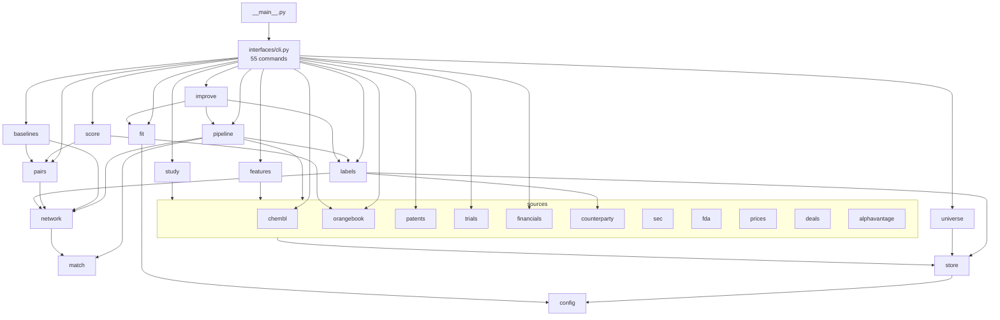
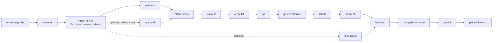

docs/20260829_v1_System_Diagram.md

# Bioindustry Intelligence Platform — system diagrams

Derived from the code at commit da29a85 (import graph and CSV writers read
by script, 2026-08-29). Mermaid source: GitHub renders it inline; VS Code
renders it with the "Markdown Preview Mermaid Support" extension.

## 1. Data flow: sources → tables → models → outputs

```mermaid
flowchart LR
  subgraph EXT[External public sources]
    SEC[SEC EDGAR<br/>submissions, XBRL facts, 8-K/10-K text]
    CT[ClinicalTrials.gov v2]
    FDA[openFDA<br/>Drugs@FDA, CRL]
    YH[Yahoo Finance<br/>daily prices]
    OB[FDA Orange Book<br/>patent expiry]
    CH[ChEMBL<br/>molecular targets]
    BQ[Google BigQuery<br/>patents export]
    AV[Alpha Vantage<br/>OVERVIEW]
  end

  subgraph ADP[src/biointel/sources — one module per source]
    sec.py; trials.py; fda.py; prices.py; orangebook.py; chembl.py; patents.py; alphavantage.py; financials.py; deals.py; counterparty.py
  end
  store.py[(store.py<br/>fetch_json / fetch_text<br/>bronze cache + manifests)]

  SEC --> sec.py & financials.py & deals.py & counterparty.py
  CT --> trials.py
  FDA --> fda.py
  YH --> prices.py
  OB --> orangebook.py
  CH --> chembl.py
  BQ --> patents.py
  AV --> alphavantage.py
  ADP --> store.py

  subgraph BRONZE[data/bronze — raw responses, never edited]
    raw[(JSON / text / zip + *.meta.json)]
  end
  store.py --> raw

  subgraph SILVER[data/silver — cleaned tables, model-agnostic]
    universe.csv; companies.csv; financials.csv; financial_snapshot.csv; trials.csv; events.csv; prices.csv; deals.csv; deal_counterparties.csv; partners.csv; partner_summary.csv; relationships.csv; patents.csv; drug_targets.csv; ma_events_universe.csv; ma_events.csv
  end
  raw --> SILVER

  subgraph GOLD[data/gold — derived panels and results]
    label_panel.csv; event_study.csv; feature_panel.csv; model_panel.csv; qa_worklist.csv; pair_feature.csv; ma_predictions.csv; pair_full_exact_report.txt
  end

  labels.py --> label_panel.csv
  study.py --> event_study.csv
  features.py --> feature_panel.csv --> model_panel.csv
  SILVER --> labels.py & study.py & features.py

  subgraph M1[Model 1 — M&A]
    score.py[score.py<br/>hand scorecard 0–100]
    improve.py[improve.py<br/>gen-2 fitted screen, price-free inputs]
    pairs.py[pairs.py<br/>MASS-exact buyer–target pairing]
    baselines.py[baselines.py<br/>rejected engines, paper baselines]
  end
  subgraph M2[Model 2 — FDA event study]
    study2[study.py<br/>CAR by outcome class]
  end

  model_panel.csv --> score.py
  feature_panel.csv --> improve.py & pairs.py & baselines.py
  trials.csv --> pairs.py
  orangebook.py --> score.py
  score.py & pairs.py --> ma_predictions.csv
  pairs.py --> pair_full_exact_report.txt
  event_study.csv -.->|CAR12m_mean column| feature_panel.csv
```

The dotted edge is the one place Model 2 output enters a table Model 1 can
read; `improve.py` excludes it by its input list (`BASE_FUND`), `score.py`
uses it for a +5 scorecard rule. Tables themselves are shared.

## 2. Module dependency graph (imports, inward only)



Every module also imports `config.py` (paths, endpoints, windows); those
edges are omitted for readability. Credentials come from `.env` through
`config.require()` at the three HTTP call sites.

## 3. Command sequence for a full rebuild (data/ empty)



Run form on Jason's machine: `& "<root>\.venv\Scripts\python.exe" -m biointel <cmd>`.
