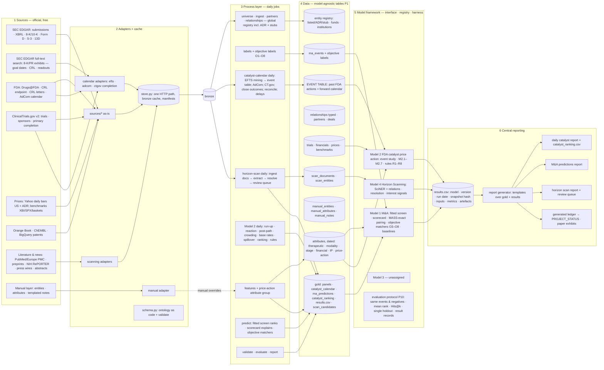
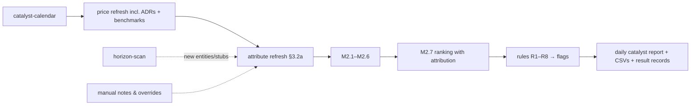

docs/20260830_v1_System_Diagram_TARGET_STATE.md

# Target-state diagrams — Bioindustry Intelligence Platform

Target state = the intended architecture once the agreed gameplan is
built (Phases 0–3 of handoff v6 §5 item 3c; Models 1, 2, 4). Current
state (as built at commit da29a85) remains in
`20260829_v1_System_Diagram.md/.png/.svg` and is updated as code changes.
Poster: `20260830_v1_System_Diagram_TARGET_STATE.png/.svg`. Tags in the
poster: AS-IS exists today · EXT extended · NEW to build.

## 1. Target data flow

## 2. Target daily run (Model 2 product)

## 3. Gate mapping (what builds each NEW/EXT item)

| Item | Gate |
|---|---|
| schema.py + validate | Phase 0.1 |
| results.csv + report generator | Phase 0.2 |
| framework core (interface, registry, harness) | Phase 0.3 |
| EVENT TABLE + calendar view | Phase 1.4 (F1) |
| EFTS adapter + parser + review queue | Phase 1.5 (F2) |
| AdCom · CT.gov completion · CRL letters · timestamps | Phase 1.6 (F3) |
| catalyst-calendar daily job | Phase 1.7 (F4) |
| price-action attribute group | Phase 2.8 (F5) |
| ADR/stub universe · benchmarks table | Phase 2.9 (F9) |
| manual layer tables + adapter | Phase 2.10 (B) |
| M2.1–M2.3 | Phase 3.11 (F6) |
| M2.4–M2.6 | Phase 3.12 (F7) |
| M2.7 ranking · rules · daily report | Phase 3.13 (F8) |
| objective matchers O3–O8 | after Phase 3 |
| Model 4 S1–S7 | after Phase 3 (or S1 earlier) |
