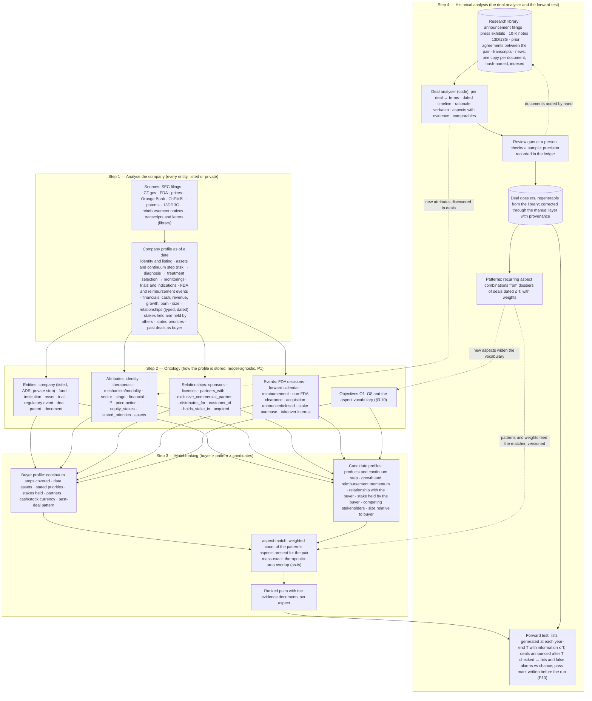
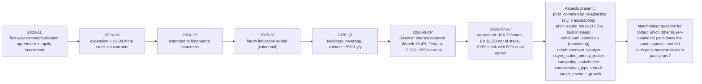

docs/20260831_v1_Research_Process_Diagram.md

# Research process — analyse the company, build the ontology, matchmake, test against history

The analyst's method as the platform runs it (Ontology v4 §3.9–§3.10,
§5.5–§5.7). Mermaid source; GitHub renders it inline. The order is the
one decided on 2026-08-31: the description and the matchmaker are built
first from analyst reasoning; the deal history is opened afterwards to
test the hypothetical pairs; the deal analyser is code and a person
checks a sample.

## 1. The four steps and the loop between them

## 2. Worked example on one record (Tempus → Personalis, Ontology v4 §2.5)

## 3. Rules the picture encodes

1. Step 1 and step 2 are built before step 4 is opened: the profile and the matcher come from analyst reasoning; the deal history tests them (decision 2026-08-31).
2. Every arrow into a dossier field carries a `doc_id` and a span; a fact without a document does not enter (Ontology v4 §3.9).
3. Patterns learned from deals up to a year are tested only on deals after that year (P10).
4. The analyser is code; the person checks a sample and that sample's precision is the number reported (label-QA pattern, `labels.qa_pass`).
