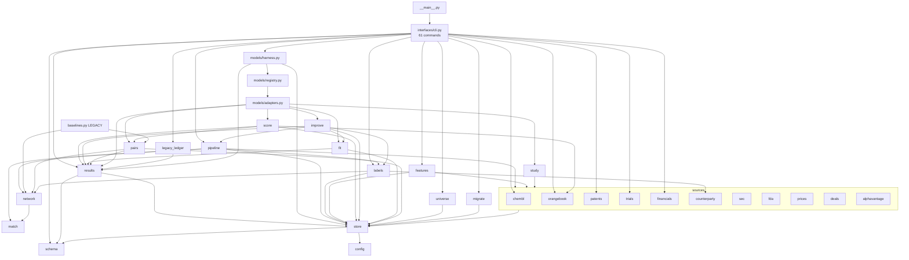
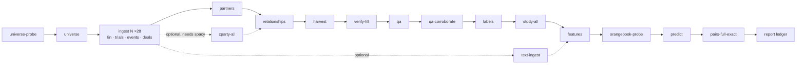

docs/20260831_v2_System_Diagram.md

# Bioindustry Intelligence Platform — system diagrams (current state after Phase 0)

Derived from the code at commit 93c2194 (2026-08-31): import graph, table
writers and the model registry. Mermaid source; GitHub renders it inline.
Supersedes docs/20260829_v1_System_Diagram.md (kept with its .svg/.png as the
pre-Phase-0 record). Target state: docs/20260830_v1_System_Diagram_TARGET_STATE.md.

## 1. Data flow: sources → two stores → registered models → ledger and exports

```mermaid
flowchart LR
  subgraph EXT[External public sources]
    SEC[SEC EDGAR<br/>submissions, XBRL, 8-K/10-K text]
    CT[ClinicalTrials.gov v2]
    FDA[openFDA Drugs@FDA, CRL]
    YH[Yahoo Finance daily bars]
    OB[FDA Orange Book]
    CH[ChEMBL]
    BQ[Google BigQuery patents]
  end

  subgraph ADP[src/biointel/sources — one adapter per source]
    sec.py; financials.py; deals.py; counterparty.py; trials.py; fda.py; prices.py; orangebook.py; chembl.py; patents.py
  end
  EXT --> ADP

  subgraph BRONZE[data/bronze — store 1: raw files, never edited]
    raw[(responses + *.meta.json)]
  end
  ADP -->|store.fetch_json / fetch_text| raw

  subgraph DB[data/biointel.duckdb — store 2: every table, schema.py enforced]
    direction TB
    SIL[silver: universe, companies, financials, financial_snapshot,<br/>trials, events, deals, deal_counterparties, partners, partner_summary,<br/>relationships, ma_events, ma_events_universe, patents, drug_targets]
    GLD[gold: label_panel, feature_panel, model_panel, event_study,<br/>event_study_summary, qa_worklist, pair_feature, activist_13d, ma_predictions]
    LED[ledger: runs, run_params, run_metrics, run_artefacts]
    PLN[planned: events_table, manual_entities, manual_attributes,<br/>manual_notes, benchmarks]
  end
  raw -->|pipeline.py, universe.py, labels.py| SIL
  SIL -->|labels.py, features.py, study.py| GLD

  STORE[store.py<br/>read_table / write_table<br/>enforce(inputs) while a model runs]
  DB <--> STORE

  subgraph REG[src/biointel/models — registry + harness]
    TS[target-screen<br/>impl scorecard (score.py) · impl fitted (improve.py, no fit/predict path yet)<br/>eval develop · tune · textsweep · robust · improve]
    AP[acquirer-pairing<br/>impl mass-exact (pairs.py) · eval pairs-exact]
    ES[fda-event-study<br/>impl daily-bars (study.py)]
  end
  STORE -->|declared tables and columns only| REG
  REG -->|results.py: params, metrics, artefacts, run_type| LED

  subgraph EXP[data/exports — disposable, regenerated]
    preds[ma_predictions.csv]
    reps[seven report .txt, rendered from records]
    ledg[ledger.csv]
  end
  REG --> preds & reps
  LED -->|report ledger| ledg

  LEG[LEGACY, not maintained: baselines.py, fit.fit, improve.holdout<br/>read data/silver_frozen_20260830, data/gold_frozen_20260830]
  LEG -.->|ledger-seed: historical-file rows| LED
```

P2 in this picture: `fitted` and `mass-exact` declare no price-derived column
and no event_study table; `scorecard` declares `MarketCap` and `CAR12m_mean`
openly (a hand scorecard is not trained); `robust` declares the price columns
because measuring the leak is its purpose. The harness refuses any read
outside the declaration.

## 2. Module dependency graph (imports, inward only)



Every module also imports `config.py`; those edges are omitted. Credentials
come from `.env` through `config.require()` at the HTTP call sites.

## 3. Command sequence for a full rebuild on a new machine (data/ empty)



The first table write creates `data/biointel.duckdb` from `schema.py`; no
`migrate` on a new machine (`migrate` exists only for machines that held
pre-2026-08-30 CSVs). `ledger-seed` adds the legacy rows once; `validate`
checks every table; `freeze` snapshots the database file.

Run form on Jason's machine: `& "<root>\.venv\Scripts\python.exe" -m biointel <cmd>`.
