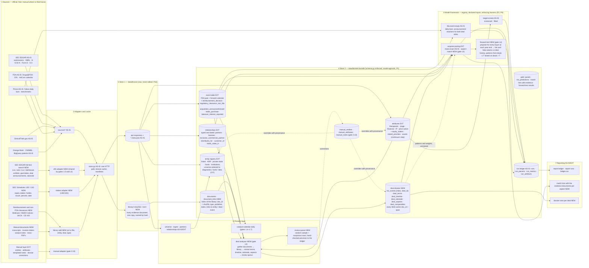

docs/20260831_v2_System_Diagram_TARGET_STATE.md

# Target-state diagram v2 — after Ontology v4 (deal dossiers on a research library)

Supersedes docs/20260830_v1_System_Diagram_TARGET_STATE.md (its .png/.svg
poster is kept as the pre-Ontology-v4 picture until a v2 poster is
rendered). Mermaid source; GitHub renders it inline. Current state as
built: docs/20260831_v2_System_Diagram.md. Tags: AS-IS exists at 79524bd ·
EXT extended by v4 · NEW built by gates L1–L4 and 2.9′ (Implementation
Plan v9).

## 1. Target data flow with the research library and the deal dossier

## 2. What is new in one sentence each

1. The research library is the evidence store: every document the platform relies on is kept once, named by its hash, indexed with its type, dates and links, and every asserted fact points back to a document and a passage.
2. The deal dossier replaces the single `ma_events` row as the unit of record for an acquisition; `ma_events` stays as the index.
3. Three new attribute families (equity stakes, stated priorities, assets with continuum step), typed dated relationships, and seven new event classes give the dossier and the matcher what the Tempus record showed they need.
4. `aspect-match` sits beside `mass-exact` under `acquirer-pairing`, hand-built, with declared inputs, and its output lists the evidence per aspect.
5. The forward test is the honesty mechanism: lists are generated with information dated on or before each year-end, then compared with the deals announced after it.

## 3. Gate mapping for the new items

| Item | Gate |
|---|---|
| library/, `documents`, `document_links`, `library add` | L1 |
| dossier tables; `equity_stakes`, `stated_priorities`, `assets`; typed edges; new event classes | L2 |
| efts adapter (shared), stakes adapter, deal analyser, review queue | L3 (efts may land in 1.5 first) |
| `aspect-match`, forward test, match lists with evidence | L4 |
| universe widening, private stubs, new baseline | 2.9′ |
